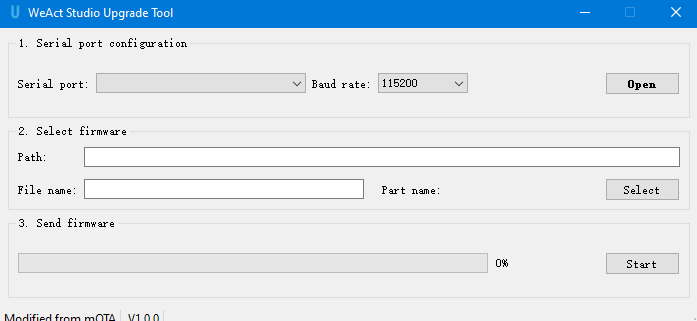

* [中文版本](./README_zh.md)
# WeActStudio.USB2CANFDV1

STM32G0B1CBT6  
> 64Mhz Max,128KB RAM,128KB ROM

CANFD/CAN2.0  
> 1500V isolation, 5Mbps Max, support cangaroo or secondary development

## SLCAN Protocol Description
> Using the virtual serial, the command is as follows:
- `O[CR]` - Opens the CAN channel
- `C[CR]` - Close the CAN channel
- `S0[CR]` - Set the nominal bit rate to 10k
- `S1[CR]` - Set the nominal bit rate to 20k
- `S2[CR]` - Set the nominal bit rate to 50k
- `S3[CR]` - Set the nominal bit rate to 100k
- `S4[CR]` - Set the nominal bit rate to 125k (default)
- `S5[CR]` - Set the nominal bit rate to 250k
- `S6[CR]` - Set the nominal bit rate to 500k
- `S7[CR]` - Set the nominal bit rate to 750k
- `S8[CR]` - Set the nominal bit rate to 1M
- `S9[CR]` - Set the nominal bit rate to 83.3k
- `Sxxyy[CR]` - Custom nominal bit rate (30Mhz CAN clock) [xx=seg1(hex), yy=seg2(hex)]
- `Y1[CR]` - Set the CANFD data segment bit rate to 1M
- `Y2[CR]` - Set CANFD data segment bit rate to 2M (default)
- `Y3[CR]` - Set the CANFD data segment bit rate to 3M
- `Y4[CR]` - Set the CANFD data segment bit rate to 4M
- `Y5[CR]` - Set the CANFD data segment bit rate to 5M
- `Yxxyy[CR]` - Custom CANFD data segment bit rate (60Mhz CAN clock) [xx=seg1(hex), yy=seg2(hex)]
- `M0[CR]` - Set to normal mode (default)
- `M1[CR]` - Set to silent mode
- `A0[CR]` - Turn off automatic retransmission (default)
- `A1[CR]` - Enable automatic retransmission (not recommended, may crash)
- `tIIILDD...[CR] `- Transfer data frame (standard ID) [ID, length, data]
- `TIIIIIIIILDD...[CR] `- Transfer data frame (extended ID) [ID, length, data]
- `rIIIL[CR]` - Transfer remote frame (standard ID) [ID, length]
- `RIIIIIIIIL[CR]` - Transfer remote frame (extended ID) [ID, length]
- `dIIILDD...[CR] `- Transmit CANFD standard frames (without BRS enabled) [ID, length, data]
- `DIIIIIIIILDD...[CR] `- Transmit CANFD extended frames (without BRS enabled) [ID, length, data]
- `bIIILDD...[CR] `- Transmit CANFD standard frames (BRS enabled) [ID, length, data]
- `BIIIIIIIILDD...[CR] `- Transmit CANFD extended frames (BRS enable) [ID, length, data]
- `V[CR]` - Reads the firmware version
- `E[CR]` - Read the failure state
- `X[CR]` - Enter firmware upgrade mode

[CR] : 0x0D (hex), `\r` (ascii)

**A status statement is returned after the command is sent**
- [CR]: transmission successful
- 0x07: transmission failed

**Note**
The CANFD message length is as follows (in hex):
- `0-8` : Same as standard CAN
- `9` : length = 12
- `A` : length = 16
- `B` : length = 20
- `C` : length = 24
- `D` : length = 32
- `E` : length = 48
- `F` : length = 64

See `Tools/cangaroo` for the host computer

## Pin Description
| pin | definition | specification |
|:--:|:--:| :--:|
|PA0|LED_RXD| Receive indicator, flashing when there is data |
|PA1|LED_TXD| Send indicator light, flashing when there is data |
|PA2|LED_READY| Status indicator, flashing 0.5S when the CAN port is opened and 1S when is in upgrade mode |
|PB9|FDCAN1_TX|FDCAN1 tx |
|PB8|FDCAN1_RX|FDCAN1 rx |
|PA12|USB_DP|USB 2.0 12Mbps|
|PA11|USB_DM|USB 2.0 12Mbps|
|PF0|OSC_IN|16Mhz XTAL|
|PF1|OSC_OUT|16Mhz XTAL|

## Partitioning Notes
| Start address | Partition name | Size | Description |
| :-: | :-: | :-: | :-: |
|0x08000000|bootloader|26 kbyte| bootloader, character watermark: USB2CANV1|
|0x08006800|app|50 kbyte| application |
|0x08013000|download|50 kbyte| download partition |

## How to compile your own firmware
See Example\Build_You_Own_firmware

## How to force firmware upgrade mode
When the firmware is brushed dead, short DIO and GND to power on, the blue light is on and then released, and the red light flashes slowly, indicating that is currently in upgrade mode.


## How to upgrade firmware
Open Tools/WeActStudio_Upgrade_Tool and follow the prompts.


## Catalog Description
| Directory name | content |
|:--:| :--:|
|Doc| Data sheet/reference manual |
|Hardware| Hardware development data |
|Examples| Software routines |
|SDK| Software SDK|
|Tools| Tools|

```
/*---------------------------------------
- WeAct Studio Official Link
- taobao: weactstudio.taobao.com
- aliexpress: weactstudio.aliexpress.com
- github: github.com/WeActStudio
- gitee: gitee.com/WeAct-TC
- blog: www.weact-tc.cn
---------------------------------------*/
```