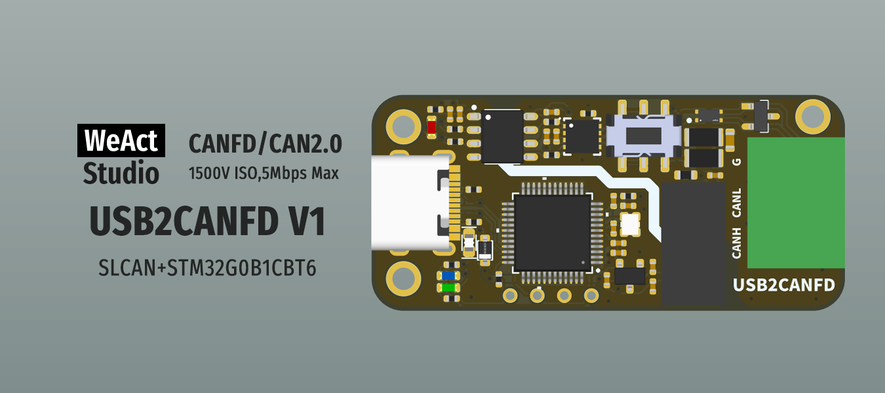
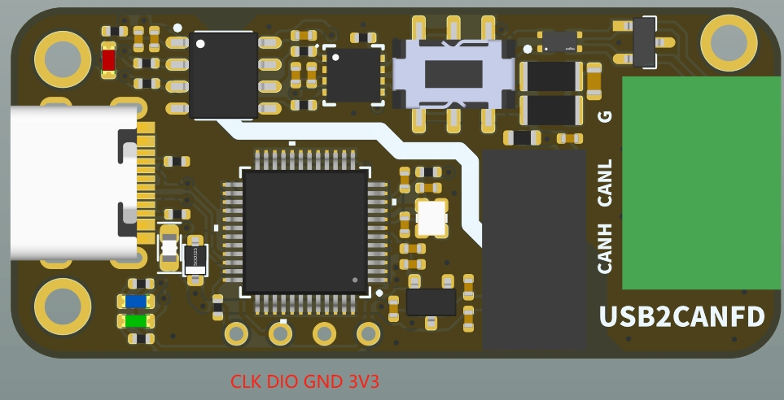
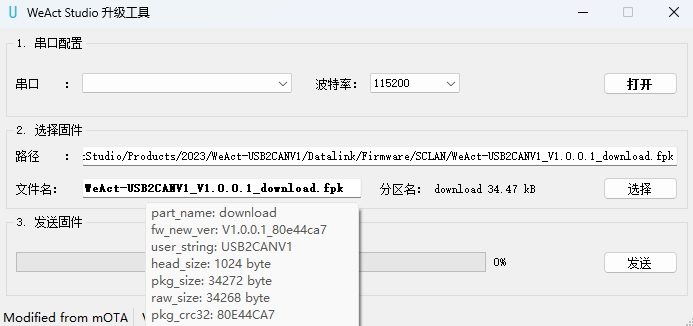

* [English version](./README.md)
# WeActStudio.USB2CANFDV1

STM32G0B1CBT6  
> 64Mhz Max,128KB RAM,128KB ROM

CANFD/CAN2.0  
> 1500V隔离, 速率最大5Mbps,支持cangaroo或二次开发

## SLCAN协议说明
> 采用虚拟串口，命令如下:
- `O[CR]` - 打开CAN通道
- `C[CR]` - 关闭CAN通道
- `S0[CR]` - 设置标称位比特率为 10k
- `S1[CR]` - 设置标称位比特率为 20k
- `S2[CR]` - 设置标称位比特率为 50k
- `S3[CR]` - 设置标称位比特率为 100k
- `S4[CR]` - 设置标称位比特率为 125k (默认)
- `S5[CR]` - 设置标称位比特率为 250k
- `S6[CR]` - 设置标称位比特率为 500k
- `S7[CR]` - 设置标称位比特率为 750k
- `S8[CR]` - 设置标称位比特率为 1M
- `S9[CR]` - 设置标称位比特率为 83.3k
- `Sxxyy[CR]` - 自定义标称位比特率(CAN时钟为30Mhz) [xx=seg1(hex), yy=seg2(hex)]
- `Y1[CR]` - 设置CANFD数据段比特率为 1M
- `Y2[CR]` - 设置CANFD数据段比特率为 2M (默认)
- `Y3[CR]` - 设置CANFD数据段比特率为 3M
- `Y4[CR]` - 设置CANFD数据段比特率为 4M
- `Y5[CR]` - 设置CANFD数据段比特率为 5M
- `Yxxyy[CR]` - 自定义CANFD数据段比特率(CAN时钟为60Mhz) [xx=seg1(hex), yy=seg2(hex)]
- `M0[CR]` - 设置为正常模式 (默认)
- `M1[CR]` - 设置为监听模式
- `A0[CR]` - 关闭自动重发 (默认)
- `A1[CR]` - 使能自动重发 (不推荐，概率死机) 
- `tIIILDD...[CR]` - 传输数据帧 (标准ID) [ID, length, data]
- `TIIIIIIIILDD...[CR]` - 传输数据帧 (扩展ID) [ID, length, data]
- `rIIIL[CR]` - 传输远程帧 (标准ID) [ID, length]
- `RIIIIIIIIL[CR]` - 传输远程帧 (扩展ID) [ID, length]
- `dIIILDD...[CR]` - 传输 CANFD 标准帧 (不使能 BRS) [ID, length, data]
- `DIIIIIIIILDD...[CR]` - 传输 CANFD 扩展帧 (不使能 BRS) [ID, length, data]
- `bIIILDD...[CR]` - 传输 CANFD 标准帧 (使能 BRS) [ID, length, data]
- `BIIIIIIIILDD...[CR]` - 传输 CANFD 扩展帧 (使能 BRS) [ID, length, data]
- `V[CR]` - 读取固件版本
- `E[CR]` - 读取故障状态
- `X[CR]` - 进入固件升级模式

[CR]：0x0D (hex),`\r` (ascii) 

**命令发送后返回状态说明**  
- [CR]：发送成功  
- 0x07: 发送失败

**注意**  
CANFD消息长度如下所示 (用十六进制表示):
- `0-8`: 与标准CAN相同
- `9`: 长度 = 12
- `A`: 长度 = 16
- `B`: 长度 = 20
- `C`: 长度 = 24
- `D`: 长度 = 32
- `E`: 长度 = 48
- `F`: 长度 = 64

上位机见Tools/cangaroo

## 管脚说明
|管脚|定义|说明|
| :--:|:--:|:--:|
|PA0|LED_RXD|接收指示灯，有数据时闪烁|
|PA1|LED_TXD|发送指示灯，有数据时闪烁|
|PA2|LED_READY|状态指示灯，CAN端口打开时0.5S闪烁，固件升级时1S闪烁|
|PB9|FDCAN1_TX|FDCAN1发送|
|PB8|FDCAN1_RX|FDCAN1接收|
|PA12|USB_DP|USB 2.0 12Mbps|
|PA11|USB_DM|USB 2.0 12Mbps|
|PF0|OSC_IN|16Mhz XTAL|
|PF1|OSC_OUT|16Mhz XTAL|

## 分区说明
|起始地址|分区名|大小|说明|
|:--:|:--:|:--:|:--:|
|0x08000000|bootloader|26 kbyte|引导装载程序，字符水印：USB2CANV1|
|0x08006800|app|50 kbyte|应用程序|
|0x08013000|download|50 kbyte|下载分区|

## 如何编译自己的固件
见Example\Build_You_Own_firmware

## 如何强制进入固件升级模式
当固件刷死时，短接DIO和GND上电，蓝灯亮起后松开，此时红灯慢闪，指示当前处于固件升级模式。


## 如何进行固件升级
打开Tools/WeActStudio_Upgrade_Tool，根据界面提示操作。


## 目录说明
|目录名称|内容|
| :--:|:--:|
|Hardware| 硬件开发资料|
|Examples|软件例程|
|Tools|工具|

```
/*---------------------------------------
- WeAct Studio Official Link
- taobao: weactstudio.taobao.com
- aliexpress: weactstudio.aliexpress.com
- github: github.com/WeActStudio
- gitee: gitee.com/WeAct-TC
- blog: www.weact-tc.cn
---------------------------------------*/
```